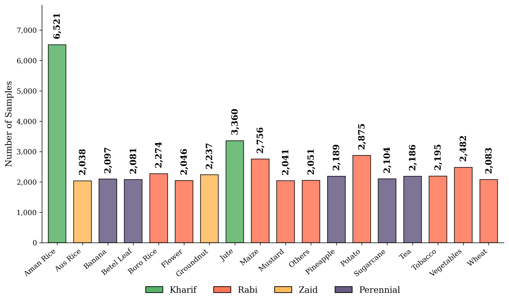

# WBCrop: A Georeferenced Dataset of 18 Crop Types Across West Bengal, India 

## Dataset Description
Developing robust agricultural monitoring systems for smallholder farming landscapes is fundamentally challenged by the scarcity of geographically diverse, field-level training data. To address this gap, we introduce **WBCrop**, an open-access, manually curated, and georeferenced dataset comprising 45,616 ground-truth samples across 18 distinct crop types in West Bengal, India. 

The dataset was systematically collected over a full agricultural year (July 2023 to June 2024) to encompass the complete crop phenological cycles of the primary Kharif, Rabi, and Zaid seasons, along with perennial crops. Data acquisition integrates extensive in-situ field surveys (9,243 points) with a scalable remote annotation pipeline utilizing Google Street View and high-resolution Google satellite imagery (36,373 points). Particular emphasis was placed on maintaining class balance to mitigate long-tail distribution biases commonly observed in real-world agricultural datasets.

This dataset provides a robust foundational resource for advancing supervised learning, foundation model fine-tuning, domain adaptation studies, and large-scale agricultural analytics in smallholder ecosystems.

## Visual Overview

### Study Area

### Class Distribution

## Technical Overview
* **File Name:** `wbcrop_points.gpkg`
* **Format:** GeoPackage (.gpkg)
* **Total Records:** 45,616 point annotations
* **Geometry Type:** Point
* **Coordinate Reference System (CRS):** EPSG:4326 (WGS 84)
* **Temporal Coverage:** Sowing/harvest cycles spanning July 2023 to June 2024 (Collection dates range from 2023-01-10 to 2024-08-21).
* **Geographic Coverage:** 21 administrative districts across West Bengal, India.

## Variable Details
The `wbcrop_points.gpkg` file contains the following attributes:

| Attribute | Data Type | Description |
| :--- | :--- | :--- |
| **id** | Integer | Unique identifier for each sample point. |
| **crop** | String | Crop type label. One of 18 classes (e.g., aman_rice, jute, tea, potato). |
| **district** | String | Administrative district name within West Bengal (21 districts). |
| **state** | String | State name; constant value 'west_bengal' for all records. |
| **sowing** | String | Approximate sowing period (e.g., jul_2023, feb_mar_2024). Value is NA if unavailable. |
| **harvest** | String | Approximate harvest period (e.g., nov_2023, mar_apr_2024). Value is NA if unavailable. |
| **collection_date**| String | Date of field data collection or imagery acquisition (YYYY-MM-DD). |
| **season** | String | Cropping season: kharif, rabi, zaid, or perennial. |
| **pheno_stage** | String | Crop phenological stage at the time of collection (e.g., vegetative, reproductive, maturity). |
| **latitude** | Float | Latitude of the sample location in decimal degrees (WGS 84). |
| **longitude** | Float | Longitude of the sample location in decimal degrees (WGS 84). |
| **geometry** | Point | Spatial point geometry (EPSG:4326). |

## Usage Notes
* **Spatial Projections:** The dataset is provided in unprojected geographic coordinates (EPSG:4326). Users should ensure that any spatial analysis or integration with other geospatial datasets accounts for this CRS, reprojecting as necessary.
* **Temporal Considerations:** The `collection_date` field records either the timestamp embedded in the Google Street View imagery or the actual field survey date for each sample. Account for this when analyzing crop phenology or seasonality.
* **Code Availability:** All custom code, scripts, and notebooks utilized for data pre-processing and technical validation are open-source and hosted on GitHub at: [https://github.com/geonextgis/WBCrop.git](https://github.com/geonextgis/WBCrop.git).

## Acknowledgements & Funding
This research is supported by the Leibniz Association under LL-SYSTAIN (Grant Labs-2024-IOR), BBSRC (BB/S020969, BB/Y513763/1). We gratefully acknowledge the financial support of the German Research Foundation (DFG) - “FAIRagro” project number 501899475. We would also like to acknowledge the project entitled "Supporting Agroecological Transitions of Agroforestry Landscapes using an Innovative Transdisciplinary Assessment Framework" (AGRECO4CAST). The project is Co-funded by the European Union: “AGROECOLOGY Call 1- AGRECO4CAST (ID132)”. Views and opinions expressed are, however, those of the author(s) only and do not necessarily reflect those of the European Union or European Research Executive Agency (REA). Neither the European Union nor the granting authority (funding ID for Germany: 031B1610A) can be held responsible for them. We also acknowledge PARAM-VC project (funding ID for Germany: 01DQ25001A), under Indo-German Science & Technology Centre (IGSTC) 2+2 call, funded jointly by the Department of Science and Technology (DST) under the Government of India and the Federal Ministry of Research, Technology and Space of Germany (BMFTR).